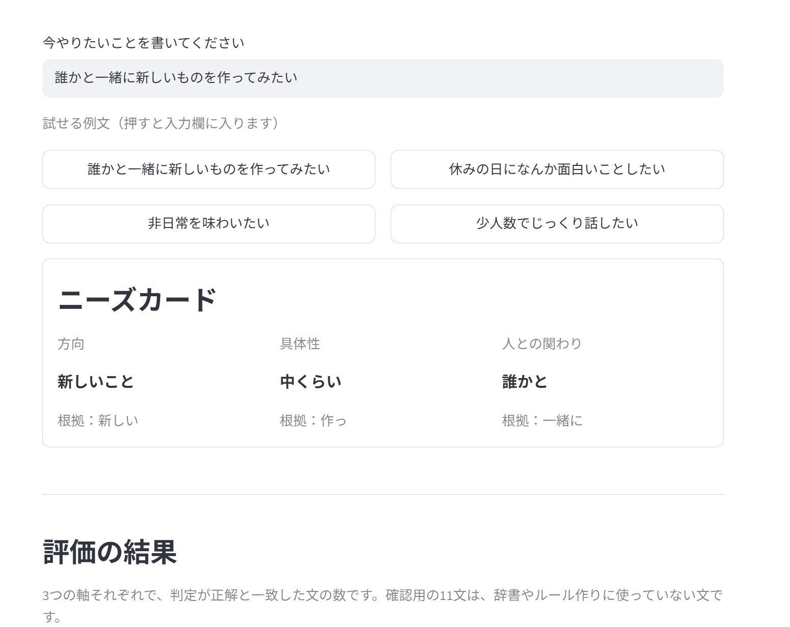
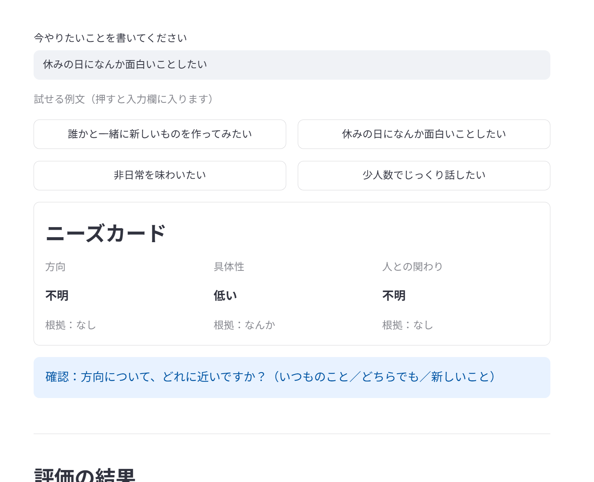
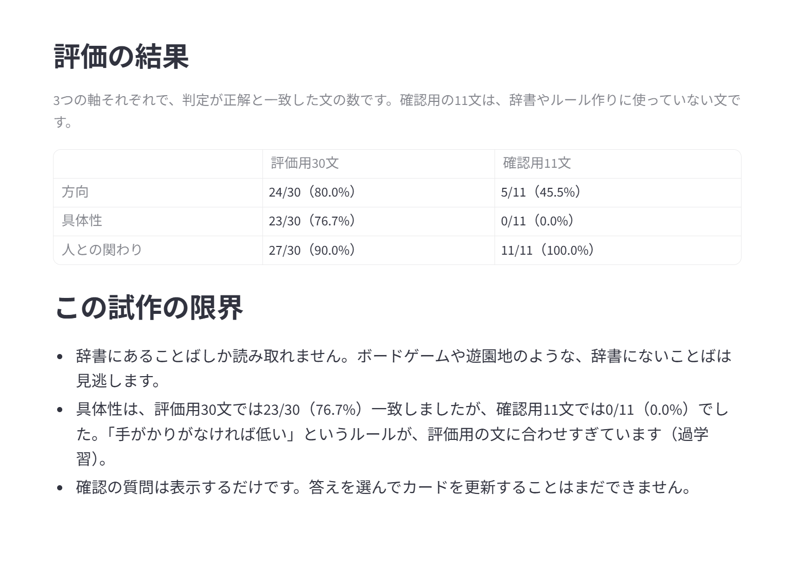

# accessible-device-guide-ai

> 🚧 開発中です

障害の有無を問わず、誰もが「まだ知らない好き」に出会えること（セレンディピティ）を目指すプロジェクトです。最初の一歩として、「なんとなく新しいことをしたい」のようなあいまいなことばから「今求めていること」を読み取り、ニーズカードとして表すプロダクトを作ります。

## 背景

情報を手に入れづらい理由には、情報にアクセスしにくいだけでなく、そもそも出会えない・気づけないこともあります。そこで、まず本人のあいまいなことばを手がかりに、今求めていることを一緒に整理する入口を作ります。障害の有無にかかわらず、誰でも状況によって新しい情報や選択肢に出会いにくくなると考えています。

## ニーズカード

入力されたことばから、次の3つの軸で「今求めていること」を表します。方向と人との関わりには「不明」もあります。具体性は、手がかりがなければ「低い」とします。

| 軸 | 値 |
|---|---|
| 方向 | いつものこと／どちらでも／新しいこと／不明 |
| 具体性 | 低い／中くらい／高い |
| 人との関わり | 一人で／どちらでも／誰かと／不明 |

判定の根拠になったことばをカードに表示します。不明の軸があれば、選択肢つきの確認質問を1つだけ返します。人の性格や心の状態は判定せず、「今求めていること」だけを表します。強いつらさを示すことばが入力された場合は、相談窓口を案内します。

## 技術検証

1. **辞書による方法**：Janomeでことばを形態素解析し、程度・方向・人との関わり・否定の手がかり語辞書で3軸を判定する
2. **評価データ**：あいまいな文を30〜40個作り、自分で正解ラベルを付ける
3. **LLMとの比較**：Amazon Bedrockが使えたら、同じ文をLLMにも解釈させ、辞書による方法と比較する
4. **画面**：Streamlitで最小限の画面を作る

セレンディピティ全体を実現するのではなく、まず「あいまいなことばの解釈」という入口を検証します。

## 技術構成

| 技術 | 使い道 |
|---|---|
| Python / Janome | 日本語の形態素解析と手がかり語の確認 |
| Streamlit | ニーズカードを表示する最小限の画面 |
| pandas / scikit-learn / Jupyter Notebook | 評価データの整理・分析と検証記録 |
| Amazon Bedrock | 利用できる場合にLLM方式を比較 |

## 進捗

- [x] テーマとニーズカードの方向性を決定
- [x] 3軸の手がかり語辞書を作成
- [x] 評価データを作成（評価用30文、確認用11文）
- [x] 辞書による判定を実装・評価
- [x] Streamlitの最小画面を作成
- [ ] （Bedrockが使えたら）LLM方式を実装して比較

## 使い方

```
pip install -r requirements.txt
streamlit run app.py
```

ブラウザで画面が開きます。文を入力すると、ニーズカードが表示されます。コマンドラインで評価だけを行うときは `python evaluate.py`（評価用30文）または `python evaluate.py data/holdout_sentences.csv`（確認用11文）を実行します。

### 画面の例

3つの軸がすべて決まった例です。軸ごとに、判定の根拠になったことばを表示します。



不明の軸があると、選択肢つきの確認質問を1つだけ表示します。



画面の下には、評価の結果とこの試作の限界を表示します。



## この試作の限界

- 辞書にあることばしか読み取れません。ボードゲームや遊園地のような、辞書にないことばは見逃します。
- 具体性は、評価用30文では76.7%一致しましたが、ルール作りに使っていない確認用11文では0%でした。「手がかりがなければ低い」というルールが、評価用の文に合わせすぎています（過学習）。
- 確認の質問は表示するだけです。答えを選んでカードを更新することはまだできません。
- 強いつらさを示すことばは、登録した言い方（「死にたい」「消えたい」「いなくなりたい」）と完全に一致する場合しか検知できません。「死にたくなる」のような言い方は見逃します。

## 判断の記録

設計上の判断とその理由は [docs/decision-log.md](docs/decision-log.md) にまとめています。

## 今後の展望

ニーズカードをもとに、ちょうどいい意外さで体験や人に出会えるタイムラインへ発展させます。将来は、本人の同意のもとで購買や位置などのデータも組み合わせ、一人ひとりに合った出会いを支援することを目指します。

## 安全とプライバシー

- 判定するのは「今求めていること」であり、人の性格や心の状態ではありません。
- 強いつらさを示すことばには、相談窓口を案内します。
- 購買や位置などのデータを使う場合は、将来、本人の同意を前提とします。
